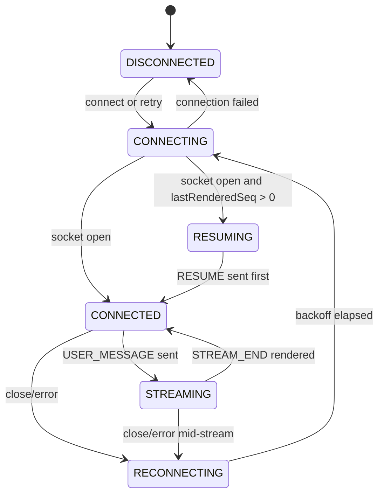
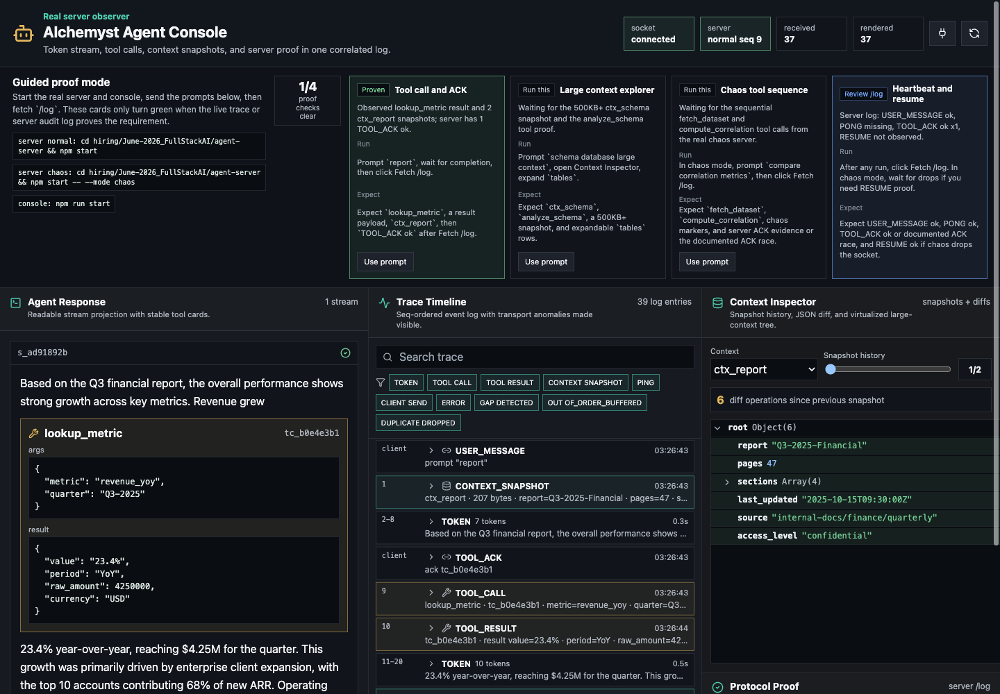
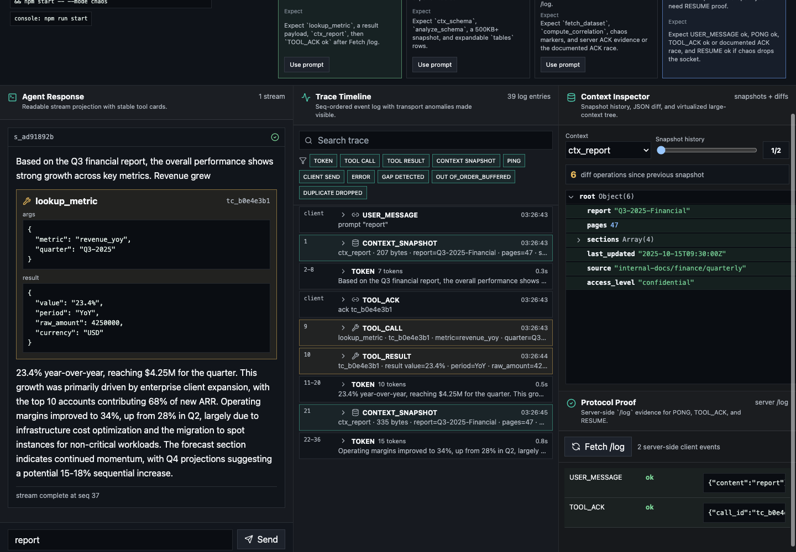
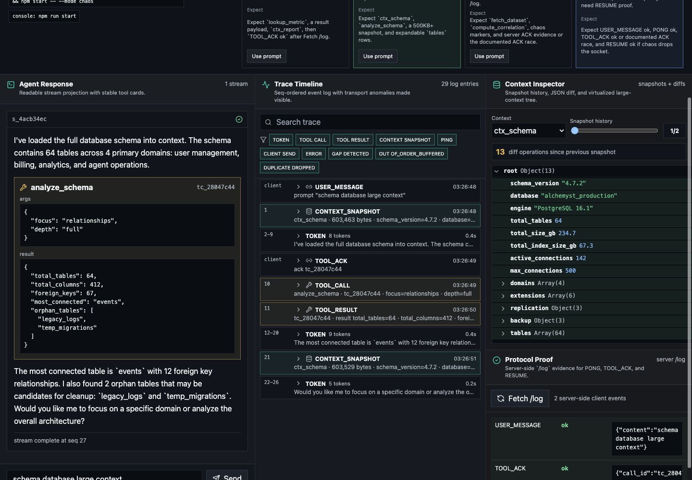

# Alchemyst Agent Console

I treated the console as an event-log projection problem: WebSocket frames are parsed in a worker, ordered/deduplicated by `seq`, appended to a single immutable log, and then projected into chat, timeline, context, and protocol-proof views. The app talks to the provided `agent-server` over `ws://localhost:4747/ws`; PONG, TOOL_ACK, and RESUME are real client messages verified with `GET /log`.

Architecture diagram and flow notes: [architecture.md](architecture.md)

## Current Verification Status

Verified locally against the provided server:

- `npm test` - 17 passing tests for reorder buffer, dedup window, JSON diff, virtualized context-tree flattening, stacked tool calls, and token grouping.
- `npm run build` - production build passes.
- Normal `report` prompt - streamed text, context snapshots, tool call card, tool result, `TOOL_ACK ok`.
- Normal `schema database large` prompt - 603 KB context snapshot renders with a virtualized JSON tree, diff view, and `TOOL_ACK ok`.
- Manual live chaos recording workflow - `docs/manual-live-proof.md` gives the exact live prompts/checks for reviewer-facing proof.
- Rapid-tool server audit - `docs/rapid-tool-server-audit.md` documents why the provided server supports sequential, not true parallel, tool calls.
- Timestamped ACK race evidence - captured a server `TOOL_ACK_TIMEOUT` 1,454ms before the client first received the delayed `TOOL_CALL`; the client sent `TOOL_ACK` in the same millisecond it observed the frame.

Submission note:

- Manual chaos proof recording: https://youtu.be/BNoWmbYy65A

## Run The Provided Agent Server

```bash
cd "hiring/June-2026_FullStackAI/agent-server"
npm ci
npm run build
npm start
```

Chaos mode:

```bash
cd "hiring/June-2026_FullStackAI/agent-server"
npm start -- --mode chaos
```

Useful server checks:

```bash
curl -s http://localhost:4747/health | python3 -m json.tool
curl -s http://localhost:4747/log | python3 -m json.tool
curl -s http://localhost:4747/reset | python3 -m json.tool
```

## Run The Console

```bash
npm install
npm test
npm run build
npm run start
```

Open `http://localhost:3000`.

Prompts that exercise the provided scripts:

- `hello` - simple token stream.
- `report` - context snapshots plus one mid-stream tool call.
- `compare correlation metrics` - two sequential tool calls.
- `lookup` - tool call before any tokens.
- `schema database large` - 603 KB context snapshot plus context diff.
- `long detailed document` - longer stream plus tool call.

## State Machine



Seq invariant: `lastReceivedSeq` is updated in the worker after ordering/dedup, while `lastRenderedSeq` is updated after React commits the log projection. Reconnect sends `RESUME` with `lastRenderedSeq`.

## Screenshots

Streamed response with a tool call:



Timeline and protocol proof:



Context inspector with large snapshot diff:



## Chaos Recording

The final reviewer-facing recording is a manual live screen recording, not a scripted protocol replay:

https://youtu.be/BNoWmbYy65A

The recording workflow is documented here:

[docs/manual-live-proof.md](docs/manual-live-proof.md)

If an MP4 copy is needed later, place it at:

```text
docs/recordings/chaos-mode-proof.mp4
```

Diagnostic sidecars:

- [docs/evidence/ack-ok-baseline.json](docs/evidence/ack-ok-baseline.json)
- [docs/evidence/ack-race-timestamped.json](docs/evidence/ack-race-timestamped.json)

## Notes For Reviewers

The provided chaos server can create an impossible `TOOL_ACK` race: it may buffer a `TOOL_CALL` in its chaos reorder buffer, start the 5-second ACK timer, and only flush the actual `TOOL_CALL` to the client after the timeout when a later `TOOL_RESULT` is sent. The client ACKs immediately when a `TOOL_CALL` frame is received; in that server race, `/log` shows `TOOL_ACK_TIMEOUT` followed by a later `TOOL_ACK unexpected`.

The timestamped reproduction is in `docs/evidence/ack-race-timestamped.json`. In that run the server logged `TOOL_ACK_TIMEOUT` at timestamp `1781360215885`; the client first received the `TOOL_CALL` at `1781360217339` and sent `TOOL_ACK` at `1781360217339`, 0ms after first observation and 1,454ms after the server had already timed out.

I inspected the provided server source for the "rapid tool calls" chaos behavior. The implementation delays, reorders, duplicates, and drops existing script messages; it does not synthesize an additional `TOOL_CALL` before the previous `TOOL_RESULT`. Details are in `docs/rapid-tool-server-audit.md`. The chat projection has a unit test covering stacked tool calls so the client behavior is still represented in code.
