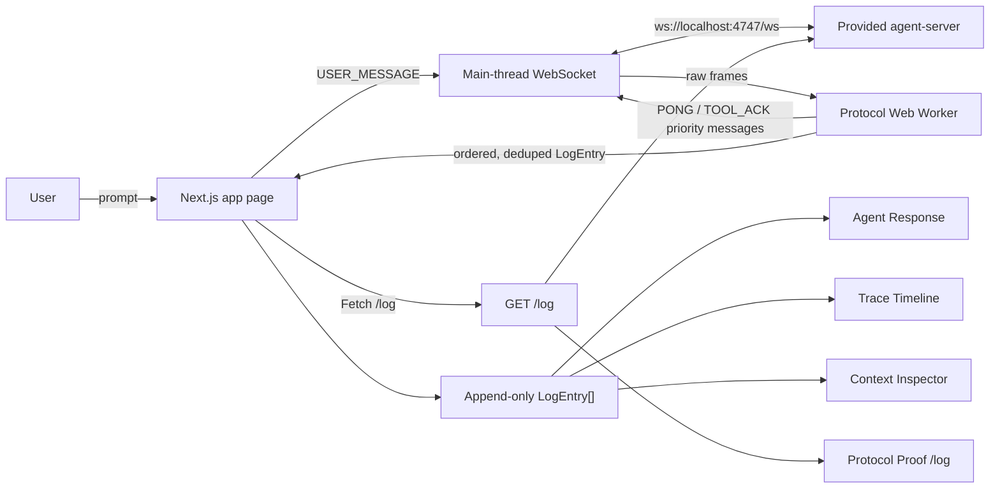
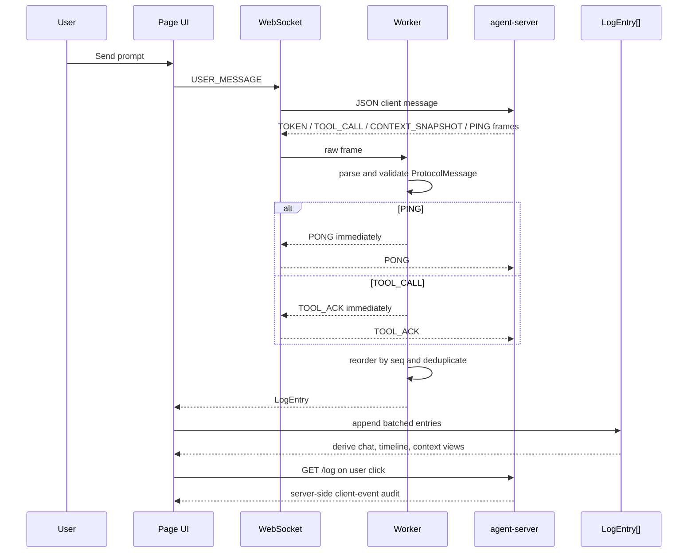
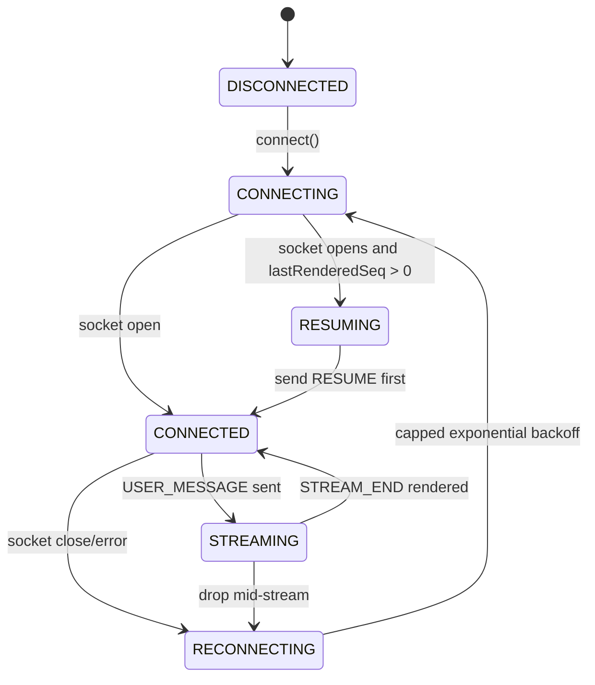
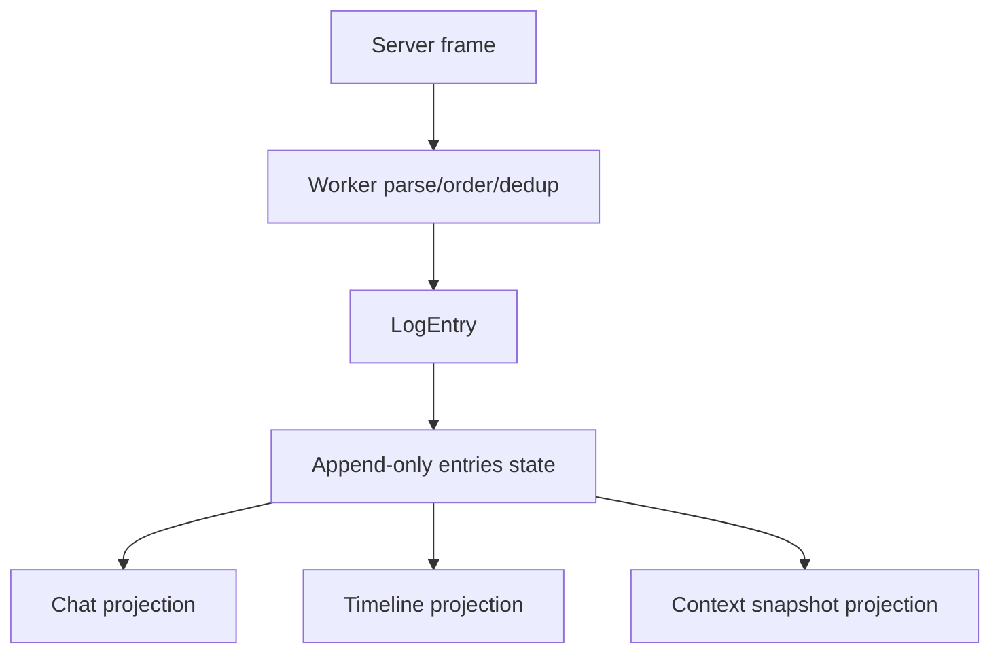

# Architecture

This app treats the agent console as an event-log projection system.

The browser receives protocol frames from the provided `agent-server`, sends priority protocol responses immediately, normalizes the remaining frames into one append-only log, and derives every visible panel from that same log. The important idea is that chat, timeline, context, and proof are not separate state machines. They are synchronized views over the same ordered evidence.

## System Diagram

## Runtime Flow

## Reconnect And Resume

The client tracks two counters:

- `lastReceivedSeq`: advanced in the worker after seq ordering and deduplication.
- `lastRenderedSeq`: advanced in the React page after the ordered log has committed to the UI.

Reconnect uses `lastRenderedSeq`, not `lastReceivedSeq`, because messages received by the worker but not painted yet still need replay from the server.

## Core Pieces

| Piece | File | Responsibility |
|---|---|---|
| Page shell and panes | `app/page.tsx` | Owns WebSocket lifecycle, app state, proof cards, chat/timeline/context/protocol panels. |
| Protocol worker | `src/workers/protocol-worker.ts` | Parses frames, sends `PONG` and `TOOL_ACK`, orders by `seq`, deduplicates, emits log entries. |
| Reorder buffer | `src/lib/reorder-buffer.ts` | Buffers future sequence numbers and drains contiguous ordered messages. |
| Dedup window | `src/lib/sliding-dedup-window.ts` | Keeps recent sequence IDs without unbounded memory growth. |
| Derived views | `src/lib/derive.ts` | Converts `LogEntry[]` into chat stream parts and compact timeline rows. |
| JSON diff/tree | `src/lib/json-diff.ts`, `src/lib/json-tree.ts` | Computes context diffs and flattens visible JSON rows for virtualization. |

## How The Panels Stay In Sync

All panels read from the same append-only log:

This avoids split-brain UI state. If a tool card is visible in chat, the corresponding `TOOL_CALL` row exists in the timeline because both came from the same `LogEntry`. Clicking a tool card selects the related timeline row; selecting timeline rows can highlight the corresponding chat part.

## Tool Call Handling

Tool calls interrupt the stream structurally:

1. Tokens append into the current text segment.
2. A `TOOL_CALL` creates a new tool-card segment below the frozen text.
3. The worker sends `TOOL_ACK` immediately when it sees the frame.
4. `TOOL_RESULT` updates the matching tool segment by `call_id`.
5. Later tokens create or continue the next text segment after the tool card.

That means the app does not rewrite one large paragraph during tool interruptions. It renders a sequence of text parts and tool parts.

## Context Handling

`CONTEXT_SNAPSHOT` entries are grouped by `context_id`.

For each context:

1. The inspector stores the snapshot history.
2. The selected snapshot is diffed against the previous snapshot.
3. The JSON tree flattens only currently visible expanded rows.
4. `@tanstack/react-virtual` renders the visible rows instead of the whole 500KB+ object.

This is why the large schema snapshot remains navigable instead of freezing the page.

## Proof Boundary

The app separates three kinds of evidence:

- Client projection evidence: chat cards, timeline rows, context tree.
- Server verification evidence: `GET /log` showing `USER_MESSAGE`, `PONG`, `TOOL_ACK`, and `RESUME`.
- Documented server limitation: chaos mode can start a `TOOL_ACK` timeout before a delayed `TOOL_CALL` is delivered to the browser.

The guided proof cards turn green only from live trace data or `/log` data already present in the app. They do not claim success from static docs.
